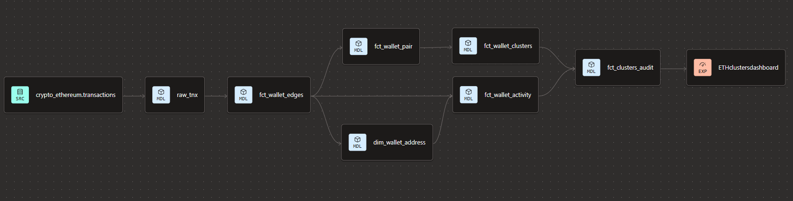
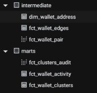
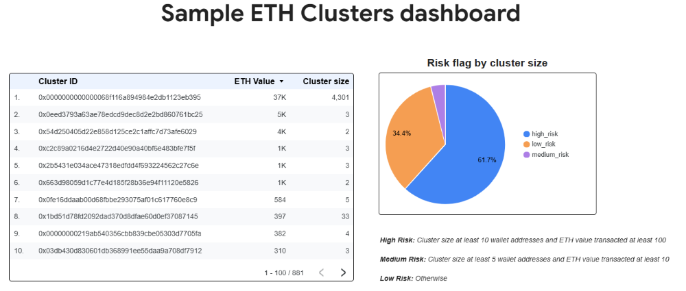
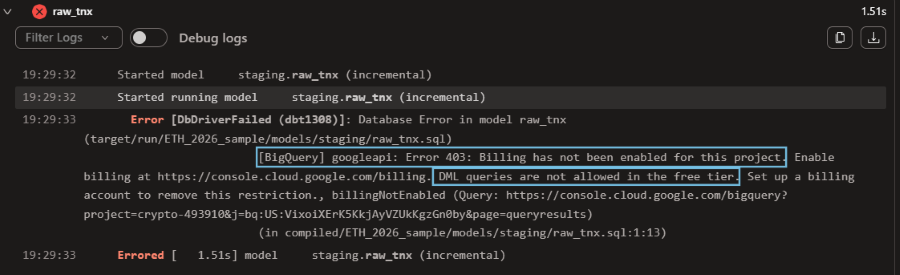
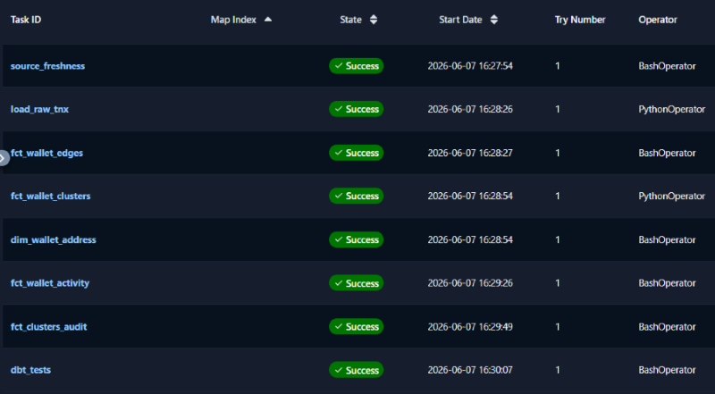

## Sample Ethereum Wallet Clustering Pipeline

An end-to-end pipeline that forms clusters by identifying wallets that have ETH transactions with each other. This exercise helps reveal potential fraudster activities. 

---
## What This Project Does

1. Loads sampled Ethereum transaction data into **BigQuery**.
2. Uses **dbt** to model wallet-to-wallet edges, dimensions, facts and cluster audit output.
3. Runs a **NetworkX graph algorithm** outside dbt to compute wallet clusters from the edge network. The cluster outputs then are written back to BigQuery for downstream modeling and validation.
4. Orchestrates data pipeline with **Airflow running in Docker Desktop**.

---

## Architecture flow: dbt lineage

 

---

## Main Models

- **Multi-layer schema** — `staging`, `intermediate` and `marts` models: each write to a  separate BigQuery dataset, configured through `+schema` in `dbt_project.yml`. 
    1. Each mode has its own sql file and can be found in the `models` folder. 
    2. The `staging` model has 2 yml files and 1 sql file:\
        2.1 [`models/staging/_src_tnx.yml`](models/staging/_src_tnx.yml): define the source data that feeds into `raw_tnx` table. So it's shown up as the 1st node in the project linage\
        2.2 [`models/staging/raw_tnx.yml`](models/staging/raw_tnx.yml): set the configurations for `raw_tnx` table. `contract` is `enforced` so that all column names and data types can't be compromised.\
        2.3 [`models/staging/raw_tnx.sql`](models/staging/raw_tnx.sql):\
        -> **The model is materialized as `incremental`** using a `merge` strategy on `tnx_hash` as the unique key. What it means is on each insert, BigQuery scans only the relevant `block_date` partition to add new rows and update any duplicated row using `tnx_hash` to determine if any duplication. It won't scan or rebuild the entire table.
        ```sql
            {{
                config(
                    materialized = 'incremental'        
                    ,unique_key = 'tnx_hash'
                    ,incremental_strategy = 'merge'
                    ,on_schema_change = 'append_new_columns'
                    ,partition_by={
                        "field": "block_date",
                        "data_type": "date"
                    }
                    ,cluster_by=["from_address"]
                )
            }}
        ```
        -> **Dates filter have 3 options:**
        
        ```sql
        --1st: Backfill - if backfill_start and backfill_end vars are given then incremental insert on the date range.
            
                and DATE(block_timestamp) BETWEEN
                    CAST('{{ var("backfill_start") }}' AS DATE)
                and CAST('{{ var("backfill_end") }}' AS DATE)

            --> dbt command:
                "dbt build -s raw_tnx \
                    --vars '{"backfill_start": "2026-01-01", "backfill_end": "2026-01-30"}'"

        --2nd: Usual run: If the 2 variables aren't avaible then load the next day from MAX(block_date) in existing table
            
                and DATE(block_timestamp) = (
                    SELECT DATE_ADD(
                        COALESCE(MAX(block_date), DATE('2026-03-01'))
                        ,INTERVAL 1 DAY
                ) 
                FROM {{ this }}
            )
            
            --> dbt command:
                "dbt build -s raw_tnx"
        
        --3rd: Full refresh: is_incremental() = false if command: dbt build --full-refresh 
        ```

        Note: raw_tnx.sql can only be used in the BigQuery paid plan
    3. BigQuery datasets as below:

        \
        


- **Macros** — the project includes a few macros to reduce repeated SQL logic. One useful macro is [`macros/audit_cluster_health.sql`](macros/audit_cluster_health.sql) which checks whether a cluster is valid and the risk category a cluster represents. 

    1. The centralized thresholds make it easier to adjust later as this macro is the one place to update instead of hunting across multiple SQL files:
        ```sql
        
        ```
    2. The macro is referenced in the [`models/marts/fct_clusters_audit.sql`](models/marts/fct_clusters_audit.sql) table but can be called from any other model that needs the same audit logic:
        ```sql
        {{ config(materialized='view') }} 

        with audit as (
            {{ audit_cluster_health() }}
        )

        select *
            ,current_date() as created_at
        from audit
        ```

- **Exposures** — This dashboard below queries from the `fct_clusters_audit` table. The linkage is set in exposure file here: [`models/exposures.yml`](models/exposures.yml) so that the dashboard is part of the project linage. In this project, it is the final node. Dashboard link: https://datastudio.google.com/s/ibPZisRVOQ8

    


---

## Semantic Model
**A semantic model named `semantic_wallet_cluster`** configured in [`models/marts/semantic_models/sem_wallet_clusters.yml`](models/marts/semantic_models/sem_wallet_clusters.yml) 

- The semantic model sits on top of `fct_clusters_audit`. It defines `cluster_id` as the primary entity, `risk_flag` and `size_status` as categorical dimensions for grouping. 

    ```yaml
    entities:
    - name: cluster
        type: primary
        expr: cluster_id

    dimensions:
    - name: risk_flag
        type: categorical
        expr: risk_flag

    - name: size_status
        type: categorical
        expr: size_status
    ```
- 3 measures are defined — `clusters_count`, `total_eth` and `high_risk_clusters_count`. These are not directly exposed as metrics but serve as reusable building blocks that the metrics layer composes from.

    ```yaml
    measures:
    - name: clusters_count
        agg: count_distinct
        expr: cluster_id

    - name: total_eth
        agg: sum
        expr: total_eth_value

    - name: high_risk_clusters_count
        agg: sum
        expr: is_high_risk
    ```
- 5 metrics are defined on top of the measures. 3 are simple - `clusters_count`, `total_eth` and `high_risk_clusters_count`. 2 are derived — `pct_high_risk` and `avg_eth_by_risk_flag`. Derived metrics allow ratio and percentage calculations without duplicating logic in SQL.
    ```yaml
    metrics:
    - name: clusters_count
        label: "clusters Count"
        type: simple   
        type_params:
        measure:
            name: clusters_count

    - name: total_eth
        label: "total ETH value"
        type: simple  
        type_params:
        measure:
            name: total_eth

    - name: high_risk_clusters_count
        label: "clusters count of high risk category" 
        type: simple
        type_params:
        measure:
            name: high_risk_clusters_count

    - name: pct_high_risk
        label: "high risk category share"
        type: derived
        type_params:
        expr: high_risk_clusters_count / clusters_count

        metrics:
            - name: high_risk_clusters_count
            - name: clusters_count

    - name: avg_eth_by_risk_flag
        label: "average ETH value by risk flag"
        type: derived
        type_params:
        expr: total_eth / clusters_count

        metrics:
            - name: total_eth
            - name: clusters_count
    ```

**Local setup requirements:**
- In `dbt_project.yml`, add this:

    ```yaml
    semantic-models:
        +enabled: true

    metrics:
        +enabled: true

    saved-queries:
        +enabled: true
    ```

- `dbt-metricflow` is an Airflow worker dependency. Make sure it's added in `requirements.txt` file under `airflow` folder

- In the `models` folder, add `dim_date` dimension. It exists solely to satisfy a time spine model requirement regardless of whether any metric uses time-based grouping. Without `dim_date` declared  in `time_spine` block, `dbt parse` fails with an error below:
    ```text
    The semantic layer requires a time spine model with granularity DAY or smaller in the project, but none was found.
    ```

**How to query sl metrics:** 
- Read more details here: [`scripts/README.md`](scripts/README.md)

---

## Project Constraints

- **BigQuery free-tier:** billing is not enabled, so the pipeline avoids BigQuery operation or product that require paid plan, for example DML statements such as `INSERT` and `DELETE` or Dataproc. This affects the Airflow design: the `load_raw_tnx` task use load job instead of DML operations specified in [`models/staging/raw_tnx.sql`](models/staging/raw_tnx.sql)

    

- **Wallet clustering task runs as a Python task outside dbt** because graph algorithm can't run in SQL-only dbt models. Dataproc can only be used with BigQuery paid plan.

- **dbt Cloud free plan** is used for dbt models only. Full orchestration is done locally. Semantic Layer queries locally

These constraints shape how the pipeline is to work around such limits.

---

## Data Pipeline: on an Airflow success run
 

See more details on the pipeline setup here: [`airflow/README.md`](airflow/README.md).

---
## Portfolio Use Case

This project is a graph analytics pipeline for further suspicious activity analysis.

The blockchain wallet is:

```text
Transactions → Connections (Edges) → Clusters → Risk category
```

A similar pattern appears in gaming, fraud, and risk analytics:

```text
Players → Same behaviors → Transacted with each other → Risk category → Further Investigation/Conclusion
```
