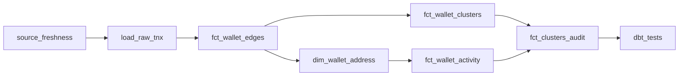
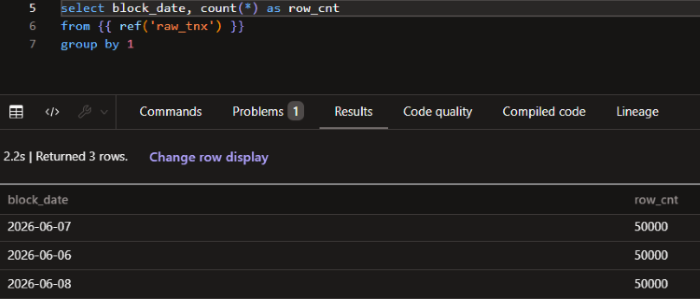
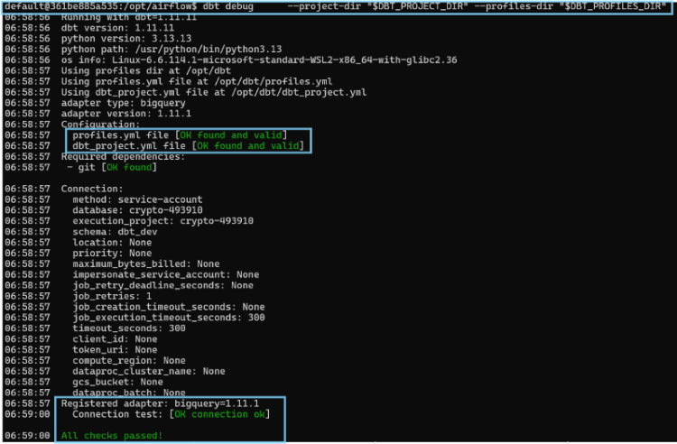
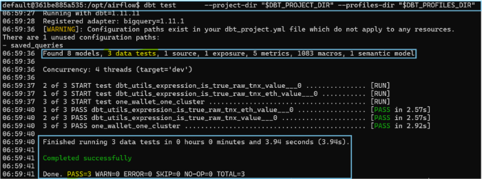
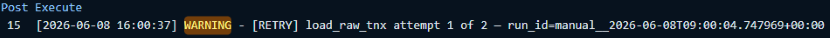
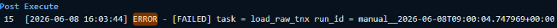
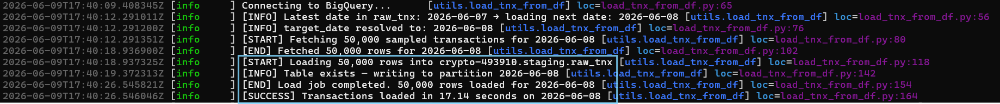

# Airflow — ETH Wallet Pipeline
## DAG File

Main DAG:


[`airflow/dags/eth_pipeline.py`](./dags/eth_pipeline.py)


Supporting Python utilities:

[`airflow/dags/utils/clusters_utils.py`](./dags/utils/clusters_utils.py)\
[`airflow/dags/utils/load_tnx_from_df.py`](./dags/utils/load_tnx_from_df.py)


---

## Pipeline Flow



| Task | Type | Purpose |
|---|---|---|
| `source_freshness` | `BashOperator` | Runs `dbt source freshness` before downstream processing. |
| `load_raw_tnx` | `PythonOperator` | Loads or mocks the raw Ethereum transaction sample. |
| `fct_wallet_edges` | `BashOperator` | Runs the dbt model that creates wallet-to-wallet transaction edges. |
| `fct_wallet_clusters` | `PythonOperator` | Runs NetworkX graph computation outside dbt. |
| `dim_wallet_address` | `BashOperator` | Builds the wallet dimension output. |
| `fct_wallet_activity` | `BashOperator` | Builds the wallet activity fact output. |
| `fct_clusters_audit` | `BashOperator` | Audits cluster outputs after graph computation and downstream dbt modeling. |
| `dbt_tests` | `BashOperator` | Runs dbt tests as the final validation step. |

---

## Local Setup Overview

1. Docker Desktop runs the Airflow services via Docker Compose.
2. Airflow mounts the dbt project into the container at `/opt/dbt`.
3. Airflow runs dbt CLI commands through `BashOperator`.
4. Airflow runs the NetworkX wallet clustering code through `PythonOperator`.

---

## Prerequisites

- Ubuntu (WSL2 on Windows)
- Docker Desktop with WSL2 backend enabled
- All commands below are run in the **Ubuntu terminal**

---

## ⚠️ Important Files

Three files are important to the pipeline.

### 1. `requirements.txt` — Python Dependencies 

The [`airflow/Dockerfile`](./Dockerfile) runs this file [`airflow/requirements.txt`](./requirements.txt)  and controls which Python packages are available to all Airflow services.


**Important notes:**
- Versions are intentionally unpinned — Docker pulls the latest compatible versions at build time (hopefully &#x1F600;).
- If a new package is needed in a DAG, add it here and rebuild the image (`docker-compose build`).
- `_PIP_ADDITIONAL_REQUIREMENTS` in [`airflow/docker-compose.yaml`](./docker-compose.yaml) has been removed in favor of the requirement file.
- Add this line in volumes in `docker-compose.yaml`:
 
```yaml
- ${AIRFLOW_PROJ_DIR:-.}/requirements.txt:/requirements.txt 
```
---

### 2. `dbt_project.yml` — dbt Project Configuration

This file [`dbt_project.yml`](../dbt_project.yml) is mounted into the container at `/opt/dbt/dbt_project.yml` via the volumes:
```yaml
- ${DBT_SOURCE_DIR:-../}:/opt/dbt
```

**Important notes:**
- Model materializations (`view`, `table`) and schemas (`staging`, `intermediate`, `marts`) are defined here 
- The semantic layer config must have `+enabled: true` for MetricFlow to work.
- Changes to `dbt_project.yml` take effect immediately on the next DAG run — no container rebuild needed.

---

### 3. `profiles.yml`  and `.env` — BigQuery Connection and dbt path 


This file [`profiles.yml`](../profiles.yml) is mounted into the container at `/opt/dbt/profiles.yml` and tells dbt how to connect to BigQuery.


**Important notes:**
- The `keyfile` path inside the profile must point to the GCP service account key **as seen from inside the container** — not your Windows or WSL path. The actual path to `GCP_KEY` is controlled inside the [`airflow/.env`](./.env) file:

```yaml
GCP_KEY=/opt/dbt/airflow-local/include/eth_dbt_connection_gcp_key.json
```

- The GCP service account key json file must exist at `airflow/include/`.

- Required Environment Variables are listed in the `.env` file. 
- Add these lines in environment in `airflow/docker-compose.yaml` file:
```yaml
    GCP_PROJECT: ${GCP_PROJECT}
    GCP_DATASET_STAGING: ${GCP_DATASET_STAGING}
    GCP_DATASET_INTERMEDIATE: ${GCP_DATASET_INTERMEDIATE}
    GCP_DATASET_MARTS: ${GCP_DATASET_MARTS}
    GCP_KEY: ${GCP_KEY}
    DBT_PROJECT_DIR: ${DBT_PROJECT_DIR}
    DBT_PROFILES_DIR: ${DBT_PROFILES_DIR}
```

- If missing, Airflow raises an `EnvironmentError` immediately instead of failure during task execution. The error setting can be found in the pipeline file [`airflow/dags/eth_pipeline.py`](./eth_pipeline.py):

```bash
DBT_PROJECT_DIR  = os.getenv("DBT_PROJECT_DIR")
DBT_PROFILES_DIR = os.getenv("DBT_PROFILES_DIR")

required_env_vars = {
    "DBT_PROJECT_DIR": DBT_PROJECT_DIR,
    "DBT_PROFILES_DIR": DBT_PROFILES_DIR
}

missing_vars = [
    key for key, value in required_env_vars.items()
    if not value
]

if missing_vars:
    raise EnvironmentError(
        f"Missing required environment variables: "
        f"{', '.join(missing_vars)}"
    )
```
---

## Ubuntu Setup

### Step 1 — Navigate to the Airflow folder

```bash
cd "/mnt/c/Users/username/.../eth_sample/airflow"
```

### Step 2 — Build the Docker image

Only needed the first time, or when `requirements.txt` changes:

```bash
docker-compose build
```

### Step 3 — Start the containers

```bash
docker-compose up -d
```

### Step 4 — Verify dependencies inside the worker

```bash
docker exec --user airflow airflow-airflow-worker-1 python -c \
  "import dbt, metricflow, networkx; print('all good')"
```

### Step 5 — Open the Airflow UI

```text
http://localhost:8080
```

Default credentials: `airflow` / `airflow`

### Step 6 — Run the pipeline

In the Airflow UI, find `eth_wallet_pipeline`, trigger a manual run.

---

### Rebuilding After Dependency Changes

When you add or remove packages from `requirements.txt`:

```bash
docker-compose down
docker-compose build
docker-compose up -d
```

---
## BigQuery Free Tier — Important Limitation
- To bypass the billing-enabled request, import this instead:
```python
from utils.load_tnx_from_df import insert_yesterday_raw_tnx #which `SELECT` raw data into a python DataFrame (limit 50,000 rows for demonstration purpose only) and load the DataFrame into BigQuery's destination table. 
```

- For testing, simply mock the task:

```python
python_callable=lambda **kwargs: log.info("[MOCK] Skipping load — free tier billing not enabled")
```

-> This allows downstream tasks to run without interruption

---

## dbt Setup Inside Local Airflow

Running dbt from Airflow requires explicit `--project-dir` and `--profiles-dir` flags,
unlike dbt Cloud where these are configured automatically.

The DAG builds a reusable `DBT_DIRS` argument:

```python
DBT_DIRS = (
    f"--project-dir \"{DBT_PROJECT_DIR}\" "
    f"--profiles-dir \"{DBT_PROFILES_DIR}\""
)
```

Every dbt `BashOperator` task appends this to the command. For example the task below:

```python
from airflow.operators.bash import BashOperator

    wallet_edges = BashOperator(
        task_id="fct_wallet_edges",
        bash_command=f"""
            set -e
            echo '[START] wallet_edges'
            dbt run -s fct_wallet_edges {DBT_DIRS}
            echo '[END] wallet_edges completed'
        """
    )
```

The dbt command then becomes:
```bash
dbt run -s fct_wallet_edges --project-dir "/opt/dbt" --profiles-dir "/opt/dbt"
```
---

## Wallet Clustering Task

The wallet clustering task runs outside dbt via `PythonOperator` because NetworkX graph
computation cannot be expressed as a SQL dbt model without dataproc which is a paid feature in BigQuery.

```text
from fct_wallet_pair in BigQuery
        ↓
Python reads wallet pairs
        ↓
NetworkX builds an undirected graph
        ↓
Connected wallets produce clusters
        ↓
Python writes fct_wallet_clusters back to BigQuery
```

**Clustering rules:**
- Each cluster is assigned a `cluster_id`. 
- Each wallet has to belong to 1 `cluster_id`. There is a `dbt test` to make sure this is the case: [`tests/one_wallet_one_cluster.sql`](../tests/one_wallet_one_cluster.sql)

**Implementation:**
- The result is written back to BigQuery `fct_wallet_clusters` table  using `compute_wallet_clusters()`. This is a load job - similar to `insert_yesterday_raw_tnx()` above - no DML involved. In the DAG, we import the function and run the task below:

```python
from airflow.operators.python import PythonOperator
from utils.clusters_utils import compute_wallet_clusters

    # Cluster Task - NetworkX
    wallet_clusters = PythonOperator(
        task_id="fct_wallet_clusters",
        retries = 0,
        execution_timeout=timedelta(minutes=30),
        python_callable=compute_wallet_clusters   
    )

```
**Why `fct_wallet_clusters` still has a dbt model file:**
- There is dbt Python model at: [`models/marts/fct_wallet_clusters.py`](../models/marts/fct_wallet_clusters.py). The file uses the same algorithm as the `compute_wallet_clusters()` function. For now, it's not part of the pipeline. 

- But it's a preferred approach in production — dbt executes the Python model via Dataproc which is a paid feature in BigQuery. So we don't need a separate `PythonOperator` task in Airflow.  

- Another reason the file stays inside the `models` folder is for dbt to pick it up in the project linage. Without it, the `fct_wallet_clusters` node won't show up. The `fct_wallet_clusters` table is used to calculate the `fct_wallet_audit` table downstream whose result is shown in a dashboard. See more on the project lineage in [`/README.md`](../README.md)

---

## Running dbt Commands Manually Inside the Container

```bash
# Access the worker container
docker exec -it airflow-airflow-worker-1 bash

# Then run dbt commands
- dbt debug --project-dir "$DBT_PROJECT_DIR" --profiles-dir "$DBT_PROFILES_DIR" 
- dbt test --project-dir "$DBT_PROJECT_DIR" --profiles-dir "$DBT_PROFILES_DIR"
```


---

## Observability

The DAG includes basic observability patterns:

- Retry callback — logs task ID, attempt number, and run ID on retry
- Failure callback — logs failed task ID and run ID
- `[START]` and `[END]` log markers around every dbt command
- Row count verification logged after each load job

```bash
# Logs from airflow:
```



```bash
# When needed to test a single task only. From Ubuntu, run:
docker exec -it airflow-airflow-worker-1 bash
airflow tasks test eth_wallet_pipeline load_raw_tnx 2026-06-08
```



