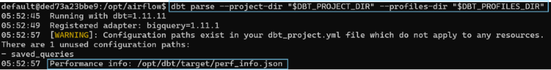
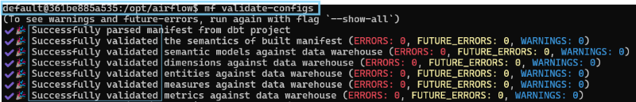
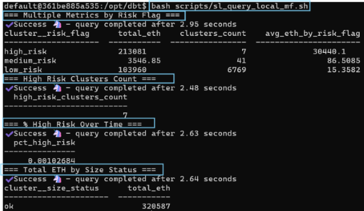

## Scripts
- This folder contains scripts for querying dbt Semantic Layer metrics using 2 approaches
- Metrics are defined here: [`models/marts/semantic_models/sem_wallet_clusters.yml`](../models/marts/semantic_models/sem_wallet_clusters.yml)

---

## Files

## 1. `sl_query_local_mf.sh`
**Use case:** Local development — no dbt Cloud plan required.
Queries metrics directly via the MetricFlow CLI (`mf` command). From Ubuntu, run in this sequence:

**dbt parse → semantic_manifest.json → mf validate-configs → mf query**

```bash
docker compose exec airflow-apiserver bash
dbt parse --project-dir "$DBT_PROJECT_DIR" --profiles-dir "$DBT_PROFILES_DIR"
```



```bash
docker exec -it airflow-airflow-worker-1 bash
cd /opt/dbt
mf validate-configs #should be `Successfully validated...`
```


```bash
# entire file:
bash scripts/sl_query_local_mf.sh

# or a selected query in the file:
mf query --metrics total_eth,clusters_count,avg_eth_by_risk_flag --group-by cluster__risk_flag
```


**Requirements:**
- dbt-core >= 1.9
- metricflow installed (`pip install dbt-metricflow`)

---

## 2. `sl_query_cloud_sdk.py`

**Use case:** dbt Cloud paid plan only.
Queries pre-defined metrics from the semantic layer without writing SQL,
via the Python SDK (`dbt-sl-sdk`).


**Run only this:**
```bash
python scripts/sl_query_cloud_sdk.py
```

**Requirements:**
- dbt Cloud environment ID
- dbt Cloud service token
- Python SDK installed (`pip install dbt-sl-sdk`)
- Paid dbt Cloud plan